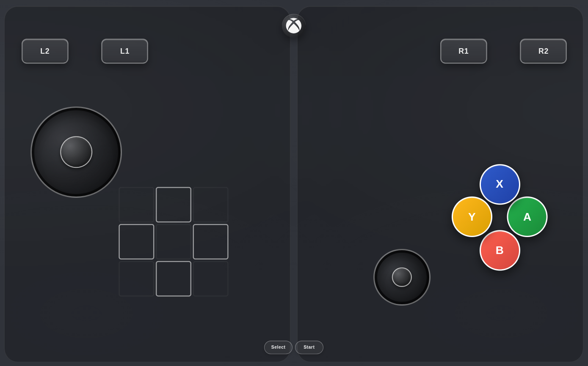
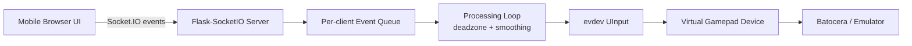

# WebController for Batocera

Turn a phone or tablet into a low-latency virtual gamepad for Batocera/Linux using a Flask + Socket.IO web app and Linux `uinput`.



## Description
WebController serves a mobile-friendly controller UI (sticks, d-pad, face buttons, triggers, system buttons) and forwards real-time input to virtual gamepads created with `evdev`.  
Each connected client gets an isolated virtual controller, enabling local multiplayer over your LAN.

## Preview
- File: `preview.png`
- Recommended screenshot content:
  - Landscape mobile view of the controller with both joysticks visible.
  - Settings panel open showing template management.
  - Optional overlay showing connected player count.

## Features
- Real-time Socket.IO input transport.
- Virtual Xbox 360-style gamepad output via `uinput`.
- Multi-player support (configurable max players).
- Input smoothing + deadzone filtering for sticks/triggers.
- D-pad support (hat + button events).
- Layout editor with template save/import/export.
- Static vs dynamic left joystick mode.
- PWA manifest and mobile splash/icon assets.

## Tech Stack
- Backend: Python, Flask, Flask-SocketIO, evdev-binary
- Frontend: HTML, CSS, vanilla JavaScript, Web Components (`virtual-joystick`)
- Runtime: Linux `uinput` kernel module

## Requirements
- Linux host (Batocera-compatible)
- Python 3.10+ (tested with modern Python 3)
- `uinput` available (`modprobe uinput`)

## Installation
1. Clone the repository:
   ```bash
   git clone https://github.com/arbaz93/joycon.git
   cd joycon
   ```
2. Create and activate a virtual environment:
   ```bash
   python3 -m venv .venv
   source .venv/bin/activate
   ```
3. Install dependencies:
   ```bash
   pip install -r requirements.txt
   ```
4. Ensure `uinput` is available:
   ```bash
   sudo modprobe uinput
   sudo chmod 666 /dev/uinput
   ```

## Configuration
You can configure runtime behavior with environment variables:

```bash
HOST=0.0.0.0
PORT=5000
LOG_LEVEL=INFO
CORS_ALLOWED_ORIGINS=*
MAX_PLAYERS=4
PROCESS_HZ=120
QUEUE_MAXLEN=512
MAX_EVENTS_PER_TICK=256
STICK_DEADZONE=0.15
TRIGGER_DEADZONE=0.02
STICK_SMOOTH_ALPHA=0.35
TRIGGER_SMOOTH_ALPHA=0.45
STICK_MAX_STEP=6000
TRIGGER_MAX_STEP=48
PAD_NAME=Microsoft X-Box 360 pad
```

## Usage
1. Start the server:
   ```bash
   python3 server.py
   ```
2. Open from a mobile device on the same network:
   ```text
   http://<server-ip>:5000
   ```
3. Rotate phone to landscape and start controlling.

### Startup script (optional)
Use `autostart-webcontroller.sh` to run at boot or from Batocera startup hooks.

## API Endpoints
- `GET /`  
  Serves the controller shell page.

## Socket Events
### Client -> Server
- `button`: `{ "button": "A|B|X|Y|LB|RB|START|SELECT|HOME|L3|R3", "state": 0|1 }`
- `joystick`: `{ "stick": "left|right", "x": -1..1, "y": -1..1 }`
- `trigger`: `{ "trigger": "LT|RT", "value": 0..1 }`
- `dpad`: `{ "x": -1|0|1, "y": -1|0|1 }`

## Folder Structure
```text
.
├── server.py
├── autostart-webcontroller.sh
├── requirements.txt
├── preview.png
├── templates/
│   └── index.html
└── static/
    ├── content.html
    ├── manifest.json
    ├── default-template.json
    ├── css/
    │   ├── styles.css
    │   └── joystick.css
    ├── javascript/
    │   ├── index.js
    │   ├── controller.js
    │   └── virtual-joystick.js
    └── icons/
```

## How It Works
1. Browser UI emits controller events through Socket.IO.
2. Server queues events per connected client.
3. Background processing loop applies deadzones/smoothing and resolves state.
4. Changed values are written to `uinput` virtual devices.
5. Emulation frontends detect those as standard controllers.

### Architecture Diagram


## Use Cases
- Couch multiplayer without extra physical gamepads.
- Quick input testing for emulator configs.
- Lightweight remote controller for kiosk/arcade setups.

## Advantages
- No native mobile app required.
- Works over LAN with standard browser support.
- Fine-grained layout customization and reusable templates.

## Roadmap / Future Improvements
- Split `controller.js` into feature modules.
- Add authentication / pairing flow.
- Add WebSocket reconnect UX and player slot UI.
- Add telemetry and optional diagnostics page.
- Add automated tests + CI pipeline.

## Contributing
1. Fork repository and create a feature branch.
2. Keep changes focused and document behavioral changes.
3. Run lint/tests (once test suite is added).
4. Open a PR with screenshots for UI changes.

## Security Notes
- Exposing this service to untrusted networks is not recommended.
- Restrict `CORS_ALLOWED_ORIGINS` in production.
- Keep `uinput` permission changes scoped to trusted host users.

## License
This project is licensed under the MIT License. See [LICENSE](./LICENSE).
